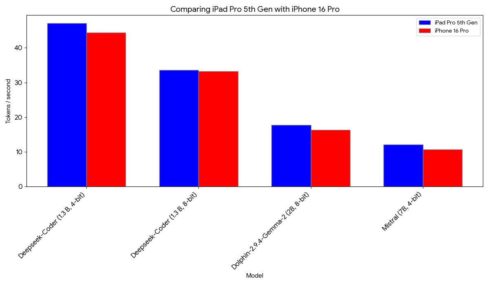
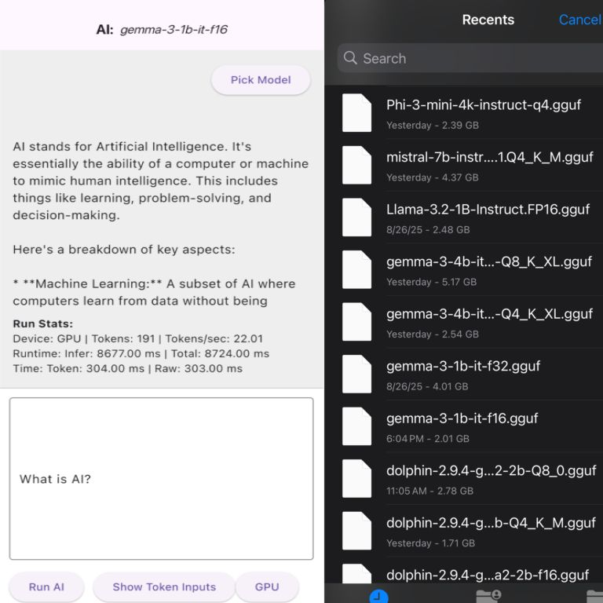
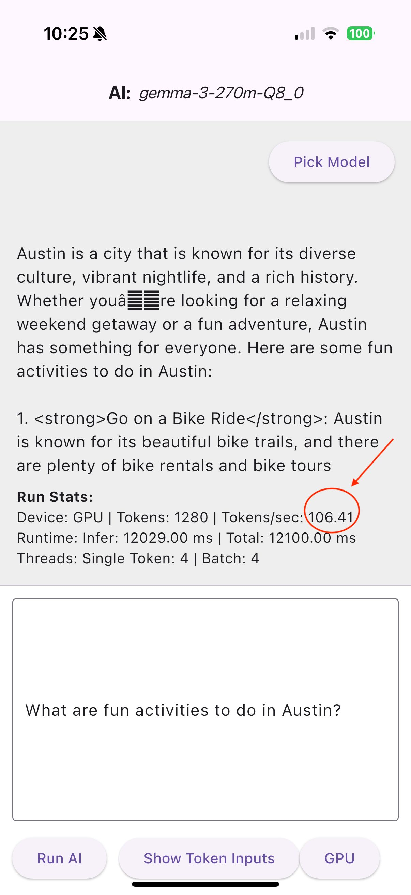
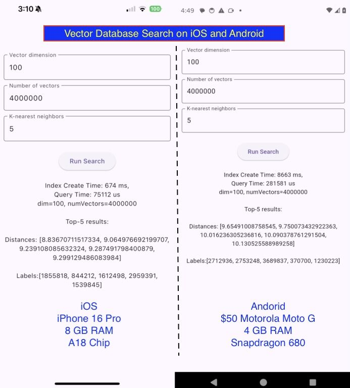
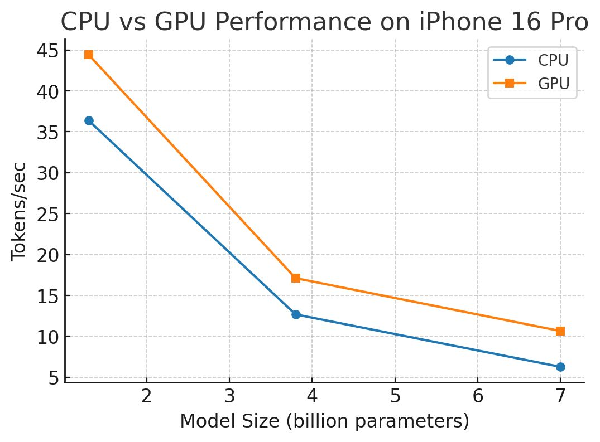
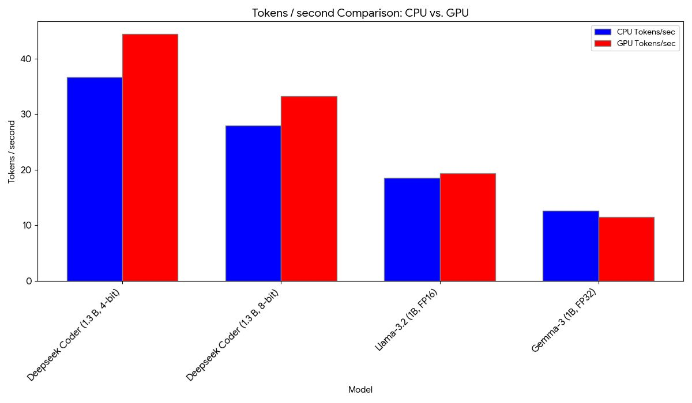

llmsonmobile
📱 Mobile-Native GenAI at the Edge

  

Running LLMs, Vector Search, and RAG directly on iOS & Android

Solving GenAI concurrency and data-control challenges by pushing inference to the edge.

Why This Project Exists

Modern GenAI systems face a fundamental scalability problem:

LLMs typically generate ~100–200 tokens/sec per request

Supporting hundreds or thousands of concurrent users requires costly server infrastructure

Cloud dependency increases latency, operational cost, and data exposure

This project explores a different approach:

Distribute GenAI workloads across mobile devices instead of scaling servers.

What This Enables

✔ Native LLM inference on iOS & Android
✔ Mobile-native vector database & similarity search
✔ On-device RAG pipelines
✔ Custom Python runtime for mobile AI workflows

Together, these capabilities turn smartphones into distributed AI edge nodes.

Native Libraries Included

This repository contains prebuilt native binaries required for on-device LLM inference across supported mobile platforms.

📦 Android (ARM64 – arm64-v8a)
File	Type	Purpose
libs/android/arm64-v8a/libllama.so	Shared Library	Core LLM inference engine
libs/android/arm64-v8a/libc++_shared.so	Shared Library	Required C++ runtime dependency

Supported ABI: arm64-v8a

🍎 iOS (Physical Device)
File	Type	Purpose
libs/ios/device/Llama.framework/Info.plist	Framework Metadata	Framework configuration
libs/ios/device/Llama.framework/Llama	Framework Binary	Native inference framework
libs/ios/device/default.metallib	Metal Shader Library	GPU acceleration shaders
libs/ios/device/libllama.dylib	Dynamic Library	Runtime linking support
libs/ios/device/libllama_cpu.a	Static Library	CPU backend
libs/ios/device/libllama_gpu.a	Static Library	GPU backend (Metal)

Architecture: ARM64 (iOS devices)

🍎 iOS (Simulator)
File	Type	Purpose
libs/ios/simulator/Llama.framework/Info.plist	Framework Metadata	Framework configuration
libs/ios/simulator/Llama.framework/Llama	Framework Binary	Simulator-compatible framework
libs/ios/simulator/libllama.a	Static Library	Simulator backend
libs/ios/simulator/libllama.dylib	Dynamic Library	Runtime linking support

Architecture: x86_64 / Apple Silicon Simulator

LLMs on Mobile

  
 
  

🤖 Model Support

1B – 7B parameter models

Quantized and mixed-precision execution

Tested models include:

DeepSeek

Phi-3

Mistral

Gemma

LLaMA

Qwen

Dolphin

Vector Database & Search

  

Fast native vector indexing and similarity search running directly on mobile hardware, without server round-trips.

Performance Benchmarks
Vector Search Benchmark

4M vectors · 100 dimensions · 5-NN query

Device	Index Build	Query Time
iPhone 16 Pro	674 ms	75 ms
Moto G (~$50)	8.66 s	281 µs

Even low-cost Android devices deliver exceptional query latency once indexed.

Token Throughput (iPhone 16 Pro)

  

CPU vs GPU Execution (iPhone 16 Pro)

  

Supported Platforms
Platform	Status
iOS	✅ Active
Android	✅ Active
Python (mobile runtime)	✅ Working
RAG	🚧 In Progress
⚖️ Disclaimer & Limitation of Liability

The native libraries and binaries included in this repository (including but not limited to libllama.so, libllama.dylib, libllama_cpu.a, libllama_gpu.a, Llama.framework, and related files) are provided "AS IS", without warranty of any kind.

To the fullest extent permitted by applicable law:

The author provides these materials without any express or implied warranties, including but not limited to merchantability, fitness for a particular purpose, and non-infringement.

The author shall not be liable for any claims, damages, losses, or liabilities arising from:

Use or misuse of the libraries

Integration into applications

Distribution or commercial deployment

Regulatory, licensing, or export compliance issues

By downloading, copying, or using these materials, you acknowledge that:

You assume full responsibility and risk.

You waive any right to bring claims against the author related to their use.

No partnership, joint venture, agency, or legal relationship is created.

If you do not agree to these terms, do not use the materials.

Takeaway

Mobile platforms are now capable of running serious GenAI workloads — including LLM inference, vector search, and Python-based workflows.

By shifting inference to the edge, we can:

Reduce server-side concurrency pressure

Improve latency and privacy

Enable cost-effective, scalable GenAI systems

The edge is ready.

⭐ If this project resonates with you, consider starring the repo or opening an issue to collaborate.
